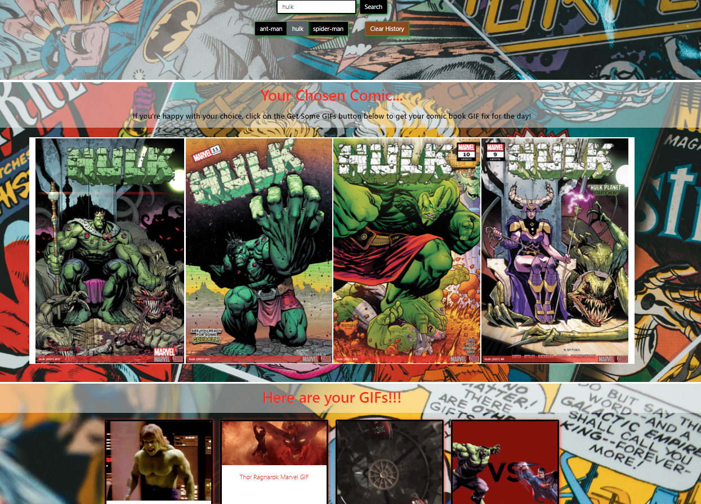

# Comic Buffs
Project 1 of the Front End Web Develoment coding bootcamp in partnership with EdX


## Table of Contents 

If your README is long, add a table of contents to make it easy for users to find what they need.

- [User Story](#User-Story)
- [Grading Requirements](#Grading-Requirements)
- [Usage](#usage)
- [Deployed Page](#Deployed-Page)
- [Credits](#Authors)
- [License](#license)


## User-Story

```
AS A comic buff
I WANT to see funny GIFs when I search for my favourite Marvel comic
SO THAT I can laugh at them
```
---
## Grading-Requirements

✔️ Use Bootstrap.

✔️ Be deployed to GitHub Pages.

✔️ Be interactive (in other words, accept and respond to user input).

✔️ Use at least two server-side APIs Links to an external site.

✔️ Does not use alerts, confirms, or prompts (use modals).

✔️ Use client-side storage to store persistent data.

✔️ Be responsive.

✔️ Have a polished UI.

✔️ Have a clean repository that meets quality coding standards (file structure, naming conventions, best practices for class/id naming conventions, indentation, quality comments, and so on).

✔️ Have a quality README (including a unique name, description, technologies used, screenshot, and link to the deployed application).


---
## Usage


In order to use the website you will need to create an account with giphy and marvel to get their respective api keys.

You can get the API keys by following the below links

Marvel API - https://developer.marvel.com/account

            Please note you will need both the Private and Public API key for the Marvel comic search to work


Giphy API - https://developers.giphy.com

            Giphy API only requires one API key.




---


---
## Deployed-Page
https://mbzaig.github.io/Project-MovieBuffs/

---
## Built With

* [JavaScript](https://www.javascript.com/)
* CSS
* [Bootstrap](https://getbootstrap.com/)
* [jQuery](https://jquery.com/)
* [Marvel_Developer_API](https://developer.marvel.com/)
* [GIPHY](https://developers.giphy.com/explorer/)

---
## What we learned during this process

* "Git commands and complexities increase with team work, and good organisation is essential to avoid issues" - **Natalie**
* "I wish I invited Nat and Noel to my birthday party" - **Muzzamil**
* "It's harder than I thought keeping to the MVP. If we'd had more time it would be amazing" - **Noel**

---
## Authors

* *Initial Work* - [Noel Galvin](https://github.com/ngalvin1991)

* *Initial Work* - [Natalie Navickas](https://github.com/NNavickas)

* *Initial Work* - [Muzzamil Baig](https://github.com/mbzaig)

---
## Acknowledgments

* Thanks for the support Sandy

---
## License

MIT License

Copyright (c) [2023] [Movie-Buffs]

Permission is hereby granted, free of charge, to any person obtaining a copy
of this software and associated documentation files (the "Software"), to deal
in the Software without restriction, including without limitation the rights
to use, copy, modify, merge, publish, distribute, sublicense, and/or sell
copies of the Software, and to permit persons to whom the Software is
furnished to do so, subject to the following conditions:

The above copyright notice and this permission notice shall be included in all
copies or substantial portions of the Software.

THE SOFTWARE IS PROVIDED "AS IS", WITHOUT WARRANTY OF ANY KIND, EXPRESS OR
IMPLIED, INCLUDING BUT NOT LIMITED TO THE WARRANTIES OF MERCHANTABILITY,
FITNESS FOR A PARTICULAR PURPOSE AND NONINFRINGEMENT. IN NO EVENT SHALL THE
AUTHORS OR COPYRIGHT HOLDERS BE LIABLE FOR ANY CLAIM, DAMAGES OR OTHER
LIABILITY, WHETHER IN AN ACTION OF CONTRACT, TORT OR OTHERWISE, ARISING FROM,
OUT OF OR IN CONNECTION WITH THE SOFTWARE OR THE USE OR OTHER DEALINGS IN THE
SOFTWARE.

---
